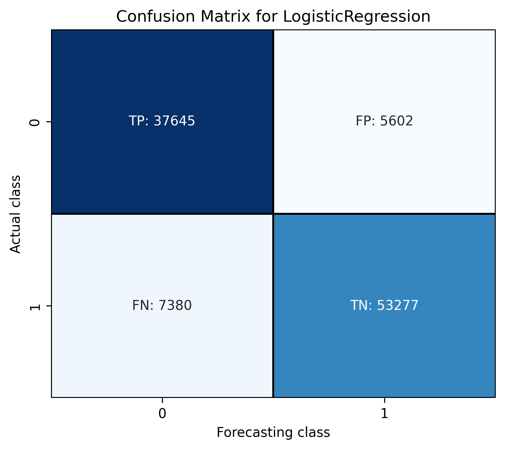
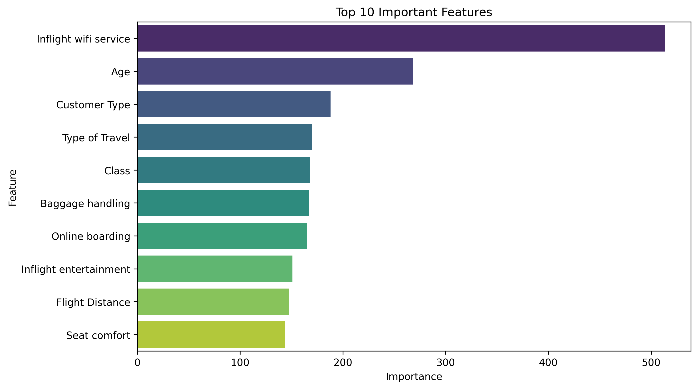

# Airline Passenger Satisfaction – ML Analysis

## 🧾 Опис проєкту (UA)

У цьому проєкті проведено аналіз даних опитування пасажирів авіаліній з метою передбачення рівня їхньої задоволеності. Було використано два підходи машинного навчання: логістична регресія та LightGBM. Дані було взято з Kaggle і попередньо оброблено. Проєкт реалізований у Jupyter Notebook та структурований для зручного аналізу та повторного використання.

📊 **Тип задачі:** Класифікація  
📁 **Джерело даних:** [Kaggle – Airline Passenger Satisfaction](https://www.kaggle.com/datasets/teejmahal20/airline-passenger-satisfaction)

### 🔍 Ключові кроки:
- Попередня обробка даних та фічінженіринг
- Побудова моделей (Logistic Regression, LightGBM)
- Оцінка за метриками: F1-score, ROC AUC
- Візуалізація результатів

### 🖼 Результати моделі

#### 📌 Матриця плутанини (Logistic Regression)
Модель логістичної регресії досягла хороших результатів при класифікації пасажирів за рівнем задоволеності.



#### 📌 Важливість ознак (LightGBM)
Найвпливовішою ознакою виявився рівень доступу до Wi-Fi на борту.



### 📁 Структура репозиторію
```
airline-passenger-satisfaction/
├── data/             # CSV-файли з даними
├── notebooks/        # Jupyter ноутбук з аналізом
├── models/           # (опціонально) збережені моделі
├── images/           # Візуалізації
├── src/              # Python-скрипти
├── README.md         # Поточний опис
├── requirements.txt  # Залежності
```

### 🧪 Як запустити:
```bash
pip install -r requirements.txt
jupyter notebook notebooks/airline_satisfaction_analysis.ipynb
```

---

## 📄 Project Description (EN)

This project explores airline passenger satisfaction using a real-world classification dataset from Kaggle. Two ML models (Logistic Regression and LightGBM) were trained to predict whether a passenger is satisfied based on features such as travel class, age, service experience, etc. The workflow is fully presented in Jupyter Notebook format.

📊 **Task:** Binary classification  
📁 **Dataset:** [Kaggle – Airline Passenger Satisfaction](https://www.kaggle.com/datasets/teejmahal20/airline-passenger-satisfaction)

### 🔍 Key steps:
- Data cleaning and feature engineering
- Model training (Logistic Regression, LightGBM)
- Evaluation using F1-score and ROC AUC
- Visual representation of results

### 🖼 Model Results

#### 📌 Confusion Matrix (Logistic Regression)
Logistic Regression performed well in identifying satisfied vs dissatisfied passengers.


#### 📌 Feature Importance (LightGBM)
The most important feature was inflight Wi-Fi service.


### 📁 Repository structure:
```
airline-passenger-satisfaction/
├── data/             # CSV data files
├── notebooks/        # Main Jupyter Notebook
├── models/           # (optional) trained models
├── images/           # Charts and visualizations
├── src/              # Python scripts
├── README.md         # Current file
├── requirements.txt  # Dependencies
```

### 🧪 How to run:
```bash
pip install -r requirements.txt
jupyter notebook notebooks/airline_satisfaction_analysis.ipynb
```

---

👩‍💻 **Author:** Iryna Senchenko (https://www.linkedin.com/in/iryna-senchenko/)